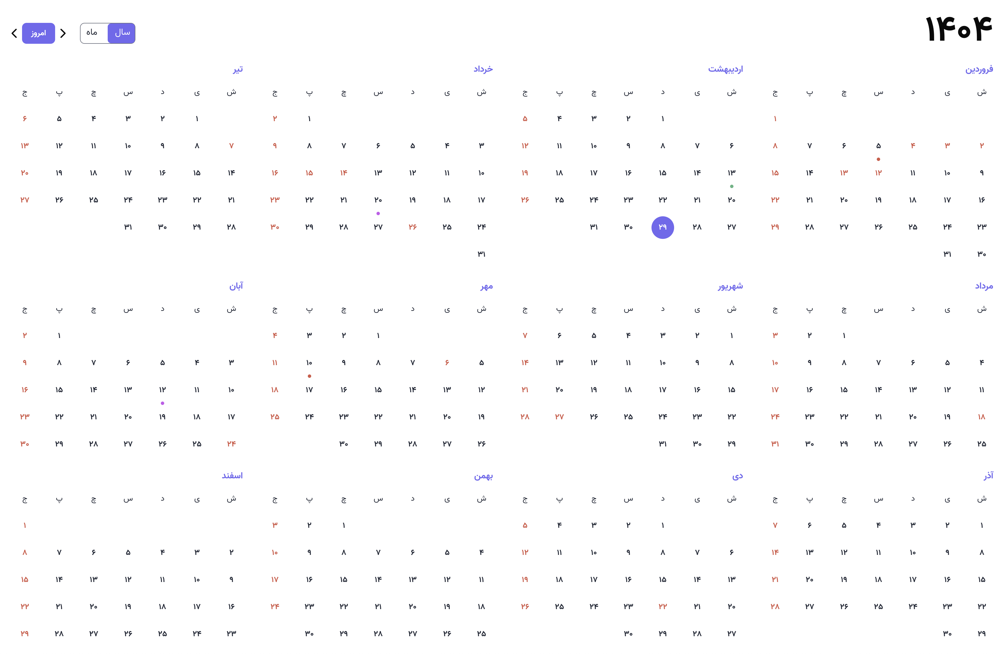
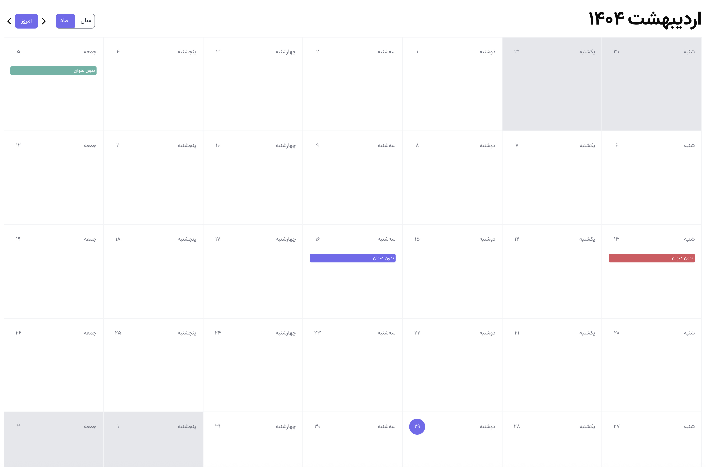

# Persian Calendar

<div align="center">
    <table style="border: none" align="center">
        <tr>
            <td style="padding:10px" align="center">
                
    <div>Year View</div>
            </td>
            <td style="padding:10px" align="center">
                
    <div>Month View</div>
            </td>
        </tr>
    </table>
</div>

Big **Persian Calendar** component built with React, Typescript and Tailwindcss.

## Features

- Supports year and month view
- Customizable theme
- Supports events
- Supports custom off dates
- Supports controlled vs uncontrolled mode

## Installation

```bash
npm install @armin-eslami/persian-calendar
```

## Example Usage

### 1. Uncontrolled component

#### Basic

```ts
import PersianCalendar from '@armin-eslami/persian-calendar';

function App() {
  return (
    PersianCalendar
        year={year}
    />
  );
}
```

#### Advanced

```ts
import PersianCalendar, {
  PersianCalendarTheme,
  PersianCalendarEvent,
  Day,
} from "@armin-eslami/persian-calendar";

function App() {
  // Override the default theme
  const theme: PersianCalendarTheme = {
    fontFamily: "Vazir",
    background: "#fff",
  };

 // Set which days of week are off
  const offDaysOfWeek: number[] = [6]; // 6 is friday

  // Set off dates of the year
  const offDates: string[] = [
    "1404/01/01",
    "1404/01/02",
    "1404/01/03",
    "1404/01/04",
    "1404/01/12",
    "1404/01/13",
    ...
  ];

  // Set events
  const events: PersianCalendarEvent[] = [
    { title: "بدون عنوان", date: "1404/02/05", color: "#ef4444" },
    { title: "بدون عنوان", date: "1404/02/13", color: "#10b981" },
    { title: "بدون عنوان", date: "1404/02/20", color: "#d946ef" },
  ];

  // Gets called when a day is clicked
  const onDayClick = (day: Day) => {
    console.log(day);
  };

  return (
    <PersianCalendar
      className="w-full h-full p-4"
      year="1404"
      month={2}
      theme={theme}
      events={events}
      offDates={offDates}
      offDaysOfWeek={offDaysOfWeek}
      onDayClick={onDayClick}
    />
  );
}

export default App;
```

### 2. Controlled component

```ts
import PersianCalendar, {
  PersianCalendarMode,
  Day,
  getCurrentYear
  getCurrentMonthIndex,
} from "@armin-eslami/persian-calendar";

function App() {
  // Track the active mode
  const [activeMode, setActiveMode] = useState<PersianCalendarMode>(
    PersianCalendarMode.YEAR
  );

  // Track the active year
  const [year, setYear] = useState<string>("1404");

  // Track active month
  const [month, setMonth] = useState<number | undefined>(
    getCurrentMonthIndex()
  );

  // Gets called when a day is clicked
  const onDayClick = (day: Day) => {
    console.log(day);
  };

  const onNext = () => {
    if (activeMode === PersianCalendarMode.YEAR) {
      setYear((prev) => String(Number(prev) + 1));
    } else {
      const curretnMonth = month ?? getCurrentMonthIndex();
      if (curretnMonth + 1 > 12) {
        setMonth(() => 1);
        setYear((prev) => String(Number(prev) + 1));
      } else {
        setMonth((prev) => Number(prev) + 1);
      }
    }
  };

  const onPrevious = () => {
    if (activeMode === PersianCalendarMode.YEAR) {
      setYear((prev) => String(Number(prev) - 1));
    } else {
      const curretnMonth = month ?? getCurrentMonthIndex();
      if (curretnMonth - 1 < 1) {
        setMonth(() => 12);
        setYear((prev) => String(Number(prev) - 1));
      } else {
        setMonth((prev) => Number(prev) - 1);
      }
    }
  };

  const onToday = () => {
    setJYear(getCurrentYear());
    setMonth(getCurrentMonthIndex());
  };

  const onModeChange = (mode: PersianCalendarMode) => {
    setActiveMode(mode);
  };

  return (
    <PersianCalendar
      className="w-full h-full p-4"
      year={year}
      month={month}
      theme={theme}
      events={events}
      offDates={offDates}
      offDaysOfWeek={offDaysOfWeek}
      onDayClick={onDayClick}
      mode={activeMode}
      onModeChange={onModeChange}
      onNext={onNext}
      onPrevious={onPrevious}
      onToday={onToday}
    />
  );
}

export default App;
```

## PersianCalendar Props

| Name               | Type                                  | Default                  | Required | Description                                                                 |
| ------------------ | ------------------------------------- | ------------------------ | -------- | --------------------------------------------------------------------------- |
| `year`             | `string`                              | `getCurrentYear()`       | Yes      | Initial year to render.                                                     |
| `month`            | `number`                              | `getCurrentMonthIndex()` | No       | Initial month index.                                                        |
| `mode`             | `PersianCalendarMode`                 | `'year'`                 | No       | Display mode of the calendar.                                               |
| `theme`            | `PersianCalendarTheme`                | `defaultTheme`           | No       | Custom theme object for styling the calendar.                               |
| `className`        | `string`                              | —                        | No       | Custom class names for the root container.                                  |
| `events`           | `PersianCalendarEvent[]`              | `[]`                     | No       | List of event objects to mark on the calendar.                              |
| `offDates`         | `string[]`                            | `[]`                     | No       | List of off-day date strings. The format must be jYYYY/jMM/jDD (1404/02/01) |
| `offDaysOfWeek`    | `number[]`                            | `[6]`                    | No       | Array of weekday indices to mark as off days (0 = Saturday, 6 = Friday).    |
| `monthTitleFormat` | `string`                              | `"jMMMM"`                | No       | Format string for month title display.                                      |
| `hasNavbar`        | `boolean`                             | `true`                   | No       | Whether to show the navbar header.                                          |
| `hasModeSwitch`    | `boolean`                             | `true`                   | No       | Whether to show the mode switch.                                            |
| `gridColumnCount`  | `1` → `12`                            | `4`                      | No       | Number of columns used in year view grid.                                   |
| `onNext`           | `() => void`                          | —                        | No       | Callback when navigating forward.                                           |
| `onPrevious`       | `() => void`                          | —                        | No       | Callback when navigating backward.                                          |
| `onToday`          | `() => void`                          | —                        | No       | Callback for jumping to current date.                                       |
| `onModeChange`     | `(mode: PersianCalendarMode) => void` | —                        | No       | Callback when view mode is toggled.                                         |
| `onDayClick`       | `(day: Day) => void`                  | —                        | No       | Callback when a day is clicked.                                             |

## PersianCalendarTheme

| Property                  | Type   | Default Value        | Required |
| ------------------------- | ------ | -------------------- | -------- |
| `primary`                 | string | `"#6366f1"`          | No       |
| `secondary`               | string | `"#818cf8"`          | No       |
| `accent`                  | string | `"#f43f5e"`          | No       |
| `background`              | string | `"#ffffff"`          | No       |
| `textPrimary`             | string | `"#1f2937"`          | No       |
| `textSecondary`           | string | `"#6b7280"`          | No       |
| `borderColor`             | string | `"#f3f4f6"`          | No       |
| `disabledMonthBackground` | string | `"#e5e7eb"`          | No       |
| `fontSize.header`         | string | `"4rem"`             | No       |
| `fontSize.subHeader`      | string | `"3rem"`             | No       |
| `fontSize.title`          | string | `"1rem"`             | No       |
| `fontSize.body`           | string | `"0.875rem"`         | No       |
| `fontSize.footer`         | string | `"0.75rem"`          | No       |
| `fontFamily`              | string | `"monospace, Arial"` | No       |
| `colors.monthTitleColor`  | string | `"#6366f1"`          | No       |
| `colors.offDayColor`      | string | `"#ef4444"`          | No       |
| `colors.hoverColor`       | string | `"#6366f1"`          | No       |

## PersianCalendarEvent

| Property | Type   | Required | Description                            |
| -------- | ------ | -------- | -------------------------------------- |
| `id`     | number | No       | Optional unique ID of the event.       |
| `title`  | string | No       | Optional title of the event.           |
| `date`   | string | Yes      | Date of the event (e.g. "1404/02/05"). |
| `color`  | string | No       | Optional hex color for the event dot.  |

## Day

| Property   | Type                   | Required | Description                                    |
| ---------- | ---------------------- | -------- | ---------------------------------------------- |
| `id`       | string                 | Yes      | Unique identifier, usually the formatted date. |
| `title`    | string                 | Yes      | Display title for the day (e.g. "۱", "۲").     |
| `active`   | boolean                | No       | Whether this day is today.                     |
| `enabled`  | boolean                | No       | Whether this day is selectable.                |
| `isOffDay` | boolean                | No       | Whether this day is an off day.                |
| `event`    | PersianCalendarEvent[] | No       | Array of events assigned to this day.          |
| `month`    | number                 | No       | The month number this day belongs to.          |

## PersianCalendarMode

```ts
enum PersianCalendarMode {
  YEAR = "1",
  MONTH = "2",
}
```

## License

The MIT License (MIT). Please see [License File](LICENSE.md) for more information.
